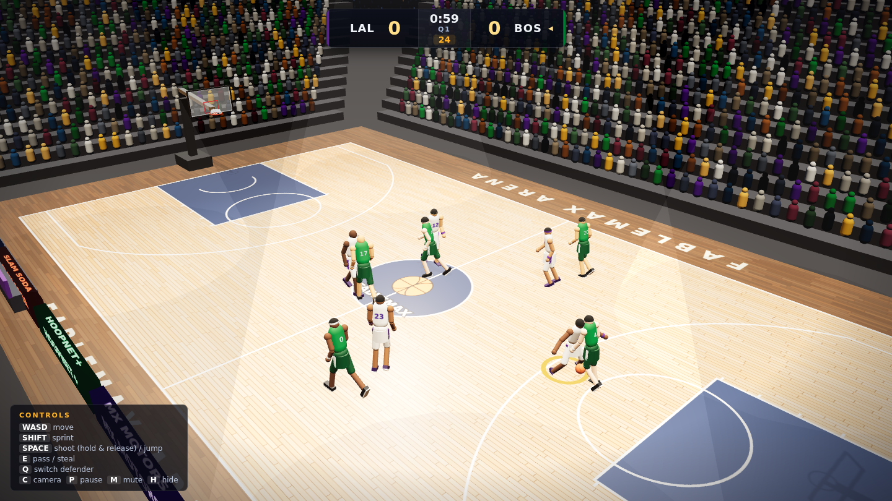
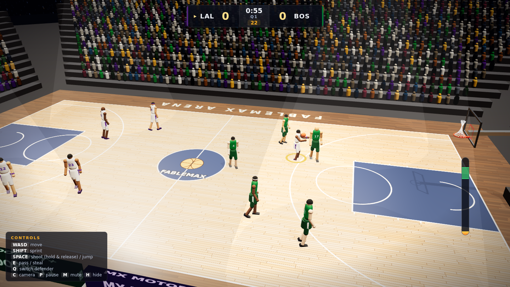

# FableMax NBA 3D 🏀

A realistic 5-on-5 arcade basketball game that runs entirely in the browser — no build step,
no external assets, no network dependencies. Everything (arena, players, crowd, textures,
sounds) is generated procedurally at runtime on top of a vendored copy of Three.js.




## Run it

Any static file server works:

```bash
# from the repo root — then open http://localhost:8000
python3 -m http.server 8000
# or
npx serve -l 8000 .
```

(A plain `file://` open won't work because the game uses ES modules.)

## How to play

You control one player at a time (glowing ring). Control follows the ball on offense and
snaps to the nearest defender on defense.

| Key | Action |
| --- | --- |
| `W A S D` / arrows | Move (screen-relative) |
| `Shift` | Sprint |
| `Space` (with ball) | Hold to charge the shot meter, release at the green band. Near the rim it becomes a layup/dunk |
| `Space` (without ball) | Jump — contest shots, block, grab rebounds |
| `E` | Pass (offense) / steal attempt (defense) |
| `Q` | Switch defender |
| `C` | Cycle cameras (broadcast / player / baseline) |
| `P` / `Esc` | Pause + box score |
| `M` | Mute · `H` toggle controls hint |

**Rules:** four quarters (selectable length), 24-second shot clock (14 after offensive
rebounds), out-of-bounds, buzzer-beaters, overtime on ties. Arcade rules — no fouls.

## What's inside

- **Physics** — custom ball simulation at 240 Hz: rim collisions against the actual torus,
  backboard restitution, floor bounces with roll-out, backspin, and a verlet-cloth net on
  each rim that reacts to swishes. Rims shake on dunks via a damped spring.
- **Shooting model** — shot-meter timing, distance/attribute/contest-based make probability,
  and misses aimed short/long/lateral so bricks, rim-outs and lucky rolls emerge from physics.
- **Players** — ten procedurally built and animated athletes (run/dribble cycles with
  crossovers, jump shots, layups, two-hand dunks, defensive slides, blocks, stumbles,
  celebrations), per-role attributes (PG→C) and per-player modifiers.
- **AI** — ball-handler decision-making (drive/shoot/pass utility), off-ball spacing and
  cuts, man-to-man defense with gap control, contests, steals, and rebound pursuit toward
  the predicted landing spot.
- **Arena** — regulation NBA court (94×50 ft, correct 3-point geometry) painted onto a
  canvas texture with a clear-coated reflective floor, ~3,000-person instanced crowd that
  reacts to the game, rotating four-sided jumbotron with a live scoreboard feed, scrolling
  LED ribbons, courtside ads, benches, light rig with volumetric cones.
- **Audio** — 100% synthesized Web Audio: crowd bed that swells with excitement, bounces,
  rim clanks, swishes, sneaker squeaks, whistles, buzzers.
- **Presentation** — broadcast/player/baseline cameras, scoreboard HUD, shot-meter with
  release grading, toasts, quarter overlays, full box score (PTS/REB/AST/STL/BLK/FG/3PT),
  six selectable teams, and an attract-mode AI demo behind the main menu.

## Project layout

```
index.html              entry point
css/style.css           HUD / menu styling
vendor/three.module.js  Three.js r170 (vendored, MIT)
src/
  main.js             bootstrap + render loop
  constants.js        court dimensions, tuning, teams & rosters
  arena.js            court, hoops, nets, crowd, jumbotron, lights
  ball.js             ball physics + shot/pass ballistics
  playerModel.js      procedural player rig + pose animation
  player.js           player entity (movement, states, jumps)
  ai.js               offense/defense/rebound decision-making
  game.js             rules, possession, clocks, scoring, stats
  cameras.js          camera rig (broadcast/player/baseline/cinematic)
  input.js            keyboard handling
  hud.js              scoreboard, meter, menus, box score
  audio.js            procedural Web Audio engine
```

### Debug hooks

`window.__fable` exposes the live game objects, and `window.__fable.setTimeScale(n)`
fast-forwards the simulation (used by the headless smoke test).
